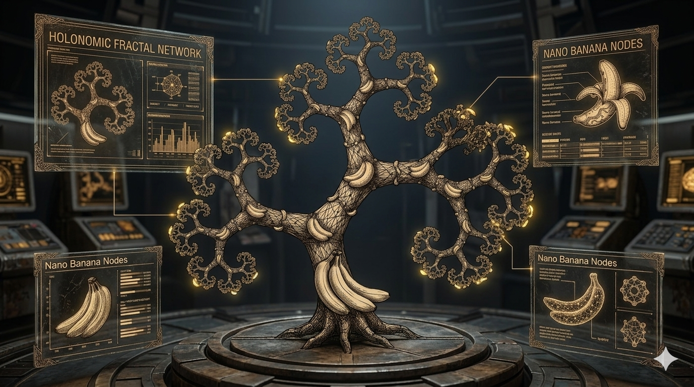
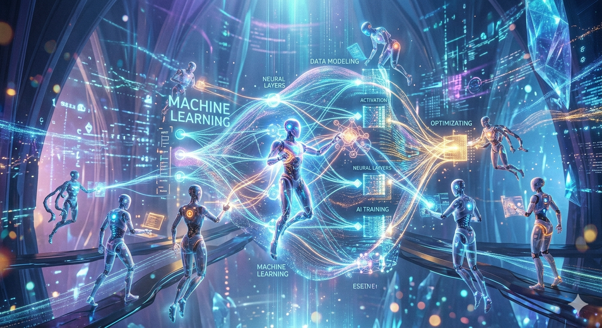

# 🤝 Contributing to ArborNet
### Building the Future of Holonomic Deep Learning

First off, thank you for considering contributing to **ArborNet**! It is people like you who make the .NET machine learning ecosystem thrive. Whether you are fixing a bug in the `'` `CudaBackend` `'` or implementing a new paper in holonomic math, we value your expertise.



---

## 🌐 Project Hub
For documentation, tutorials, and community showcases, visit our official site:
**[www.ozzieai.com](https://www.ozzieai.com/)**

---

## 🧪 Our Research Focus
ArborNet isn't just another tensor library. We are specifically looking for contributions that push the boundaries of:
* **Holonomic Pathfinding:** Gradient descent on non-Euclidean manifolds.
* **Kernel Fusion:** Optimized `'` `C++` `'` and `'` `CUDA` `'` kernels for custom activation functions.
* **Fluent API Design:** Ensuring that complex math feels like simple logic.


---

## 🛠️ Development Workflow

To maintain the high quality of the ArborNet core, please follow these steps:

1. **Fork the Repo:** Create your feature branch.
2. **Implement Logic:** Ensure your code follows the fluent pattern.
3. **Add Tests:** All new operations must pass the `'` `TensorComprehensiveTests` `'` suite.
4. **Wrap Everything:** All `'` `ITensor` `'` operations should be device-agnostic.

```bash
# Clone the repository
git clone [https://github.com/ArborNet/ArborNet.Core.git](https://github.com/ArborNet/ArborNet.Core.git)

# Run the test suite
dotnet test
```

---

## 📜 Coding Standards
We follow a strict "Fluent First" philosophy. When adding a new method to the `'` `ITensor` `'` interface, ensure it returns an `'` `ITensor` `'` to allow for chaining.

```csharp
// The Right Way (Fluent)
var result = tensor.Square().Mean().Sqrt();

// The Wrong Way (Static/Procedural)
var result = TensorOps.Sqrt(TensorOps.Mean(TensorOps.Square(tensor)));
```

---

## ⚖️ Mathematical Rigor
If you are contributing to the `'` `Autograd` `'` engine, please ensure you define the Jacobian-vector product (JVP) correctly. For any holonomic connection, we expect the curvature $\Omega$ to remain zero during propagation:

$$ \Omega = dA + A \wedge A = 0 $$



---

## 📬 Communication
* **Issues:** Use GitHub Issues for bug reports and feature requests.
* **Discussions:** Join our forum at **[ozzieai.com](https://www.ozzieai.com/)** for deep-dive research talk.

---

> "Code is poetry; tensors are the ink."
> **The **[www.ozzieai.com](https://www.ozzieai.com/)** Research Collective**